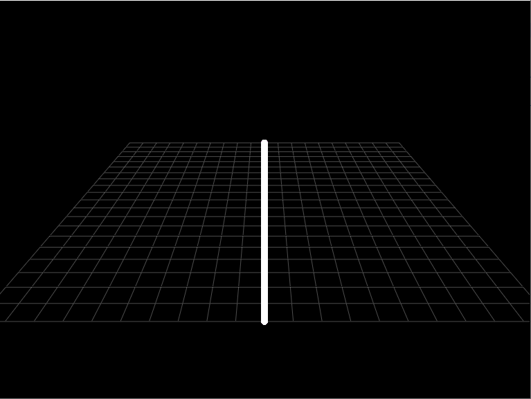
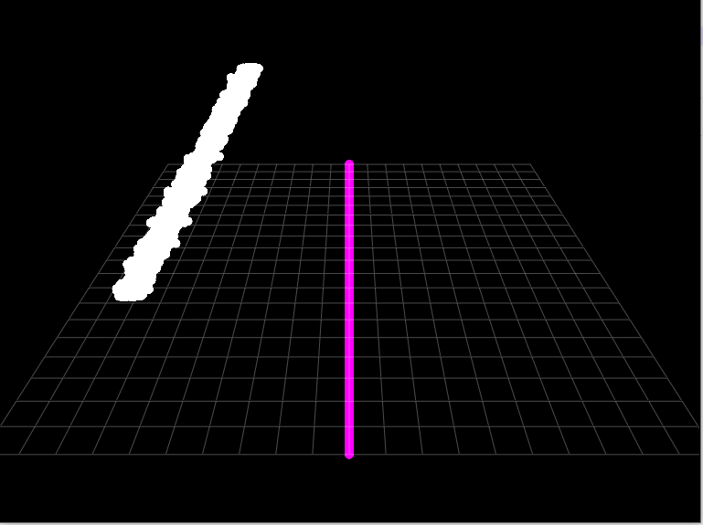
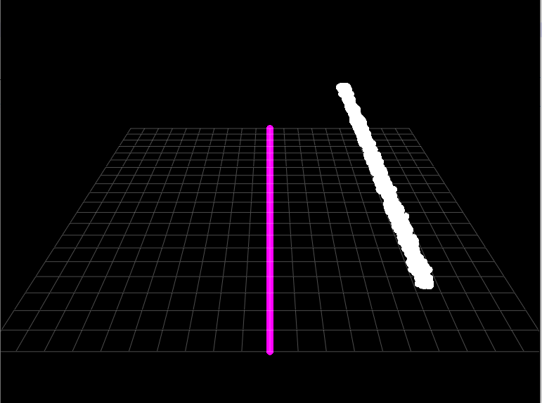

# Acoustic tracking demos

## Preferably create a separate conda/virtual environment 
The code was written with Python 3.11 version using a conda environment. 
```>>> conda create -n acousticdemo python==3.11``` 

And then activate the environment with 
```>>> conda activate acousticdemo``` 

## Installation 
Clone this repo with ```git clone https://github.com/thejasvibr/realtime_sound_plotting.git``` and then ```cd``` into the 
repo and preferably create a new virtual/conda environment to run the visualisation in. Then install the package with 
```pip install -r .\requirements.txt```.


### Graphical time-delay visualisation on laptop

The ```realtime_timedelay_vis.py``` module visualises the time-delay between the two microphone channels present in most computers nowadays. 
Each stereo audio buffer is bandpass filtered between  0.5-10 kHz. If the buffer audio is above threshold then it is cross-correlated and 
the peak of the cross-correlation is visualised as the line moving to the left or the right - indicating which side the sound is coming from. 

The level of the sound is also visualised in the waveform and the apparent 'height' of the incoming audio. 








All scripts are based on the [sounddevice](https://python-sounddevice.readthedocs.io/en/0.3.7/#callback-streams) library for sound acquisition.
The 'fast' visualisations requires [pyqtgraph](http://www.pyqtgraph.org/). 

### Check microphone settings (disable pre-processing)
This module relies on the microphone providing *raw* audio data for calculations. This is in contrast to some laptops/OS's pre-processing the
audio to remove echoes/noise/buzzing etc. The pre-processing can interfere with time-delay and threshold calculations. 
For Windows this can be checked by going to ```Control Panel -> Hardware and Sound -> Sound```. In ```Sound``` move to the ```Recording``` tab, and 
then to ```Properties --> Advanced``` and uncheck ```Enable audio enhancements```.